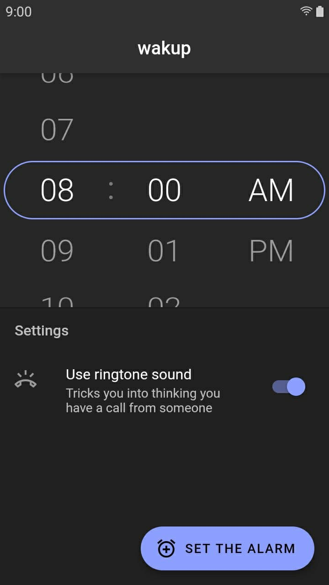
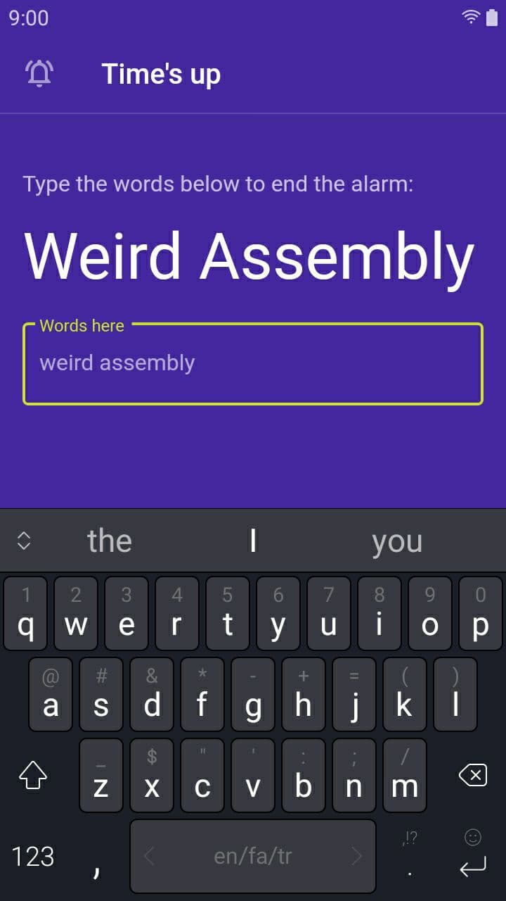

# wakup
The ultimate alarm app for Android, made for those who can't wake up using normal alarms.

It has no snooze and "turn off" buttons; instead it displays some random words on the screen and you have to type them to make the sound and vibration stop.

## Feautures (and missing ones)
- [x] Has no snooze and "turn off" buttons
- [x] Uses your ringtone sound so you think someone has called you. This makes you wake up easier and makes you think someone cares about you.
- [x] Small in size: ~6MB.
- [ ] Currently it can't schedule multiple alarms, or repeat them in next days.
- [ ] It fails if you mute your phone. please don't.
- [ ] No iOS support. You probably expected iOS support because the app is made with Flutter but I don't have a Macbook and I hate Apple and its users.

## Screenshots
| Homepage | Alarm info page | Testing page |
|:--|:--|:--|
|  |  |  |

## Download
I'm too poor and lazy to publish it on Google Play or any other market.

However __you can download the app from the [releases](https://github.com/hkh12/wakup/releases) page__, or you can clone the repo and build the app yourself.
